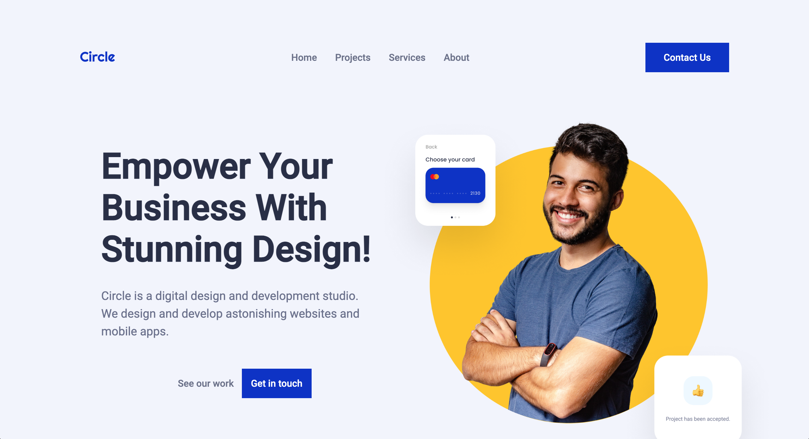

<!--
Un archivo README.md es un archivo de markdown que contiene información sobre un proyecto. Típicamente se encuentra en el directorio raíz de un proyecto y se utiliza para proporcionar documentación e instrucciones para otros que puedan querer usar o contribuir al proyecto.

Para los desarrolladores, un archivo README.md bien estructurado y bien documentado puede ser beneficioso de varias maneras. Puede ayudar a asegurar que otros puedan entender y usar fácilmente el proyecto, lo que puede conducir a más contribuciones y una comunidad más activa alrededor del proyecto. Además, puede hacer que sea más fácil para los desarrolladores incorporar a nuevos miembros del equipo y para que otros entiendan el propósito y la funcionalidad del proyecto.

Para otros desarrolladores, un archivo README.md bien estructurado y bien documentado puede ser un recurso valioso cuando se trata de entender o usar un proyecto. Puede proporcionar información sobre los objetivos, funcionalidad y cómo usar del proyecto, lo que puede ahorrar tiempo y esfuerzo al tratar de ponerse al día en un nuevo proyecto. Además, un buen README.md también puede proporcionar información sobre cómo contribuir al proyecto y directrices para hacerlo, lo que puede facilitar que otros se involucren y contribuyan al proyecto.

En el caso específico de comenzar en este mundo de desarrollo como desarrollador junior, lo cual todos ustedes, queridos estudiantes caen bajo ella, puede beneficiarse de la siguiente manera:

Tener un archivo README.md bien estructurado y bien documentado también puede ser beneficioso para los nuevos desarrolladores junior que están tratando de entrar en el mercado laboral. El mercado laboral para desarrolladores es altamente competitivo, y tener un portafolio de proyectos bien documentados y fácilmente comprensibles puede diferenciar a un desarrollador junior de otros. Un archivo README.md bien escrito demuestra la habilidad de un desarrollador para comunicar y documentar su trabajo de manera efectiva, lo cual es una habilidad importante en cualquier entorno profesional. Además, tener un portafolio de proyectos bien documentados también puede ayudar a los desarrolladores junior a entender y explicar mejor su propio trabajo, lo cual puede ser beneficioso en entrevistas laborales y otros entornos profesionales. En general, un archivo README.md bien estructurado y bien documentado puede ayudar a los desarrolladores junior a mostrar sus habilidades y destacar en un mercado laboral competitivo.
-->

<!-- Estructura -->
<!--
*** Estoy usando enlaces de estilo "referencia" de markdown para la legibilidad.
*** Los enlaces de referencia están encerrados en corchetes [ ] en lugar de paréntesis ( ).
*** Vea la parte inferior de este documento para la declaración de las variables de referencia
*** https://www.markdownguide.org/basic-syntax/#reference-style-links
-->

<!-- Por favor no borrar este elemeno, ayuda al elemento "back to top" -->

<!-- PROJECT LOGO -->
 

  
  <h3 align="center">Circle Landing Agency Website</h3>
  <a href="https://midterm-project.vercel.app/">Visit Website</a>

<!-- TABLE OF CONTENTS -->

  
Table of Contents

  <ol>
    <li>
      <a href="#acerca-del-proyecto">Acerca del Proyecto</a>
      <ul>
        <li><a href="#construido-con">Construido Con</a></li>
      </ul>
    </li>
    <li>
    <a href="#roadmap">Roadmap</a>
     <ul>
     <li><a href="#backlog">Back log</a></li>
        <li><a href="#day-one">Lunes 23, Enero 2023</a></li>
        <li><a href="#day-two">Martes 24, Enero 2023</a></li>
        <li><a href="#day-three">Miercoles 25, Enero 2023</a></li>
        <li><a href="#day-four">Jueves 26, Enero 2023</a></li>
        <li><a href="#day-five">Viernes 27, Enero 2023</a></li>
      </ul>
    </li>
    <li><a href="#acerca">Acerca</a></li>
    <li><a href="#agradecimientos">Agradecimientos</a></li>
    <li><a href="#desafío-técnico">Desafío Técnico</a></li>
    <li><a href="#grande-error">Grande Error</a></li>
  </ol>

<!-- ABOUT THE PROJECT -->

## Acerca del Proyecto

Este es una adaptación de la página web "https://circle-agency-35d27e.webflow.io/", proyecto que pone a prueba conocimientos nativos de HTML, CSS, Grid CSS, CSS Flexible Box Layout ( abreviado como flexbox ), y JavaScript. Este proyecto también incluye media queries, por lo tanto es un proyecto responsive en formato escritorio y teléfono móvil.
Está desplegado a la página web "https://vercel.com/dashboard" conectado a través de GitHub, accesible a través del siguiente enlace - https://midterm-ironhack-nu.vercel.app/ -.

(<a href="#readme-top">back to top</a>)

### Construido Con

El proyecto está construido mediante el uso de HTML 5, CSS 3, CSS grid, CSS flexobox y ECMAScript v6., a través de Visual Studio Code.

(<a href="#readme-top">back to top</a>)

## Roadmap

###### Lunes 23, Enero 2023

- [x] Inicializar el proyecto - enlazar el archivo git local con el repositorio reomoto de GitHub
- [x] Crear el esqueleto de HTML
- [x] Estilizar la sección nav
- [x] Estilizar la sección main

###### Martes 24, Enero 2023

- [x] Estilizar la seccion logo bar
- [x] Estilizar la sección project
- [x] Estilizar la sección clients review
- [x] Estilizar la sección servicio
- [x] Estilizar la sección support
- [x] Estilizar la sección footer
- [x] Crear el esqueleto de la página "contact us"
- [x] Crear el esqueleto de la página "projects"

###### Miercoles 25, Enero 2023

- [x] Obtener la data input del formulario de "contact us"
- [x] Obtener la data del formulario de la sección "email support"
- [ ] Fetch las imágenes y texto en la página de proyectos
- [x] Estilizar la página "contact us"
- [x] Estilizar la página "projects"

###### Jueves 26, Enero 2023

- [x] Adaptar la página a formato teléfono móvil mediane el uso de media queries
- [x] Finalizar el maquetado

###### Viernes 27, Enero 2023

- [x] Arreglar el menú de la hamburguesa
- [x] Actualizar las secciones del readme
- [x] Arreglos mínimos en versión móvil
- [x] Conectar a Vercel
- [x] Preparar la presentación
 

(<a href="#readme-top">back to top</a>)

<!-- Acerca de mi -->

## Acerca

Mi nombre es Alexis y he comenzado a estudiar recientemente desarrollo de páginas web en la escuela Ironhack.
Este es mi primer proyecto "completo" en el que he podido poner a prueba los conocimientos obtenidos hasta el momento, finalizado el plazo de entrega del proyecto he percibido ciertos fallos y estructuras que podría mejorar para futuros proyectos.

Alexis García - [https://twitter.com/Nihonmurasaki] - lexisgasa3007@gmail.com

Project Link: [https://github.com/lexisgasa/midterm-ironhack]

Presentation Link: [https://docs.google.com/presentation/d/1Mg84vkg91QHKOyP_ibTAxArrDhHVyVrgxEkT-iL9Wv8/edit#slide=id.g200e94e848e_0_134]

(<a href="#readme-top">back to top</a>)

<!-- ACKNOWLEDGMENTS -->

## agradecimientos

Agradecimiento especial al lead teacher Diego Zito, y a los dos teacher assistant Aleix y Carlos "Jarko" por estar siempre para ayudar en cualquier momento incluso fuera de horario laboral.

También agradecer a los compañeros/as por crear un ambiente de estudio idoneo, especialmente aquellos que se han quedado en el afterwork creando un vínculo especial.

(<a href="#readme-top">back to top</a>)

## Desafío Técnico

Dos mayores desafios con este proyecto, el primero relacionado con CSS que es el que más tiempo ha ocupado, ya que una vez arreglados los pequeños fallos y aparentar la corrección, en la sección media queries he comprobado que no estaba bien hecho, ergo he tenido que volver a hacerlo y arreglarlo en la medida de lo posible.
El segundo problema viene dado con javascript, le di demasiadas vueltas a problemas que eran realmente sencillos, y los complicados no he sido capaz de sacarlos, el caso de fetch.